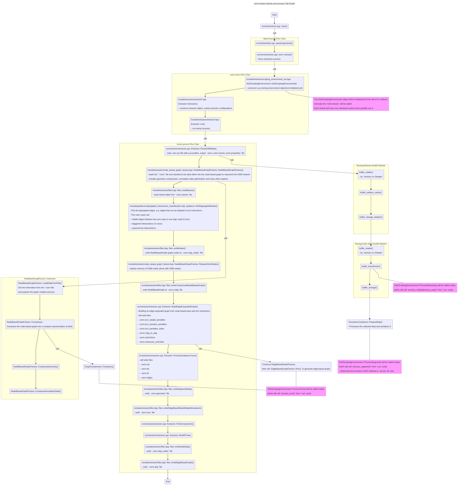

# Interaction Between C++ and Lua In OSRM
This document will describe how do `C++` and `Lua` work together in [OSRM](https://github.com/Project-OSRM/osrm-backend).     
Please read [OSRM Profiles](https://github.com/Project-OSRM/osrm-backend/blob/master/docs/profiles.md) to get understanding of why need `Lua` profiles and how does it work.     
In practice, the `Lua` profiles actually will be integrated by `C++` codes. I.e. it will be loaded by `C++`, and the main functions(`setup()/process_node()/process_way()/process_turn()/process_segment()`) also will be called by `C++`(`osrm-extract`).     

## Lua Scripting Environment Initialization
`Lua` profile will be loaded and referenced by `C++` object `ScriptingEnvironmentLua`. Below describes flow chart of the method `Sol2ScriptingEnvironment::InitContext()`.     

## Invoke Lua Functions In osrm-extract
The most important methods provided by `Lua` profiles are `process_node()/process_way()/process_turn()/process_segment()`. All of these functions will be Invoked in `osrm-extract` processing. Please refer to below call graph for `osrm-extract` processing, **purple** comments in the graph describes where the `Lua` functions be Invoked.      
