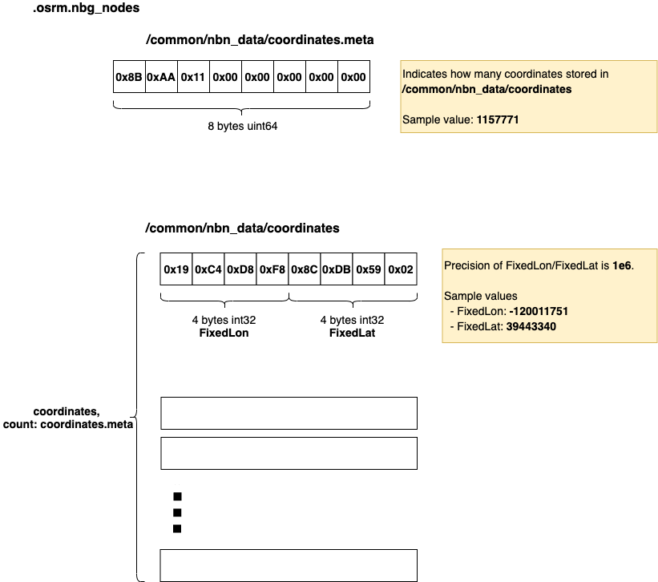

- [.osrm.nbg_nodes](#osrmnbgnodes)
  - [List](#list)
  - [osrm_fingerprint.meta](#osrmfingerprintmeta)
  - [/common/nbn_data/coordinates, /common/nbn_data/coordinates.meta](#commonnbndatacoordinates-commonnbndatacoordinatesmeta)
    - [Layout](#layout)
    - [Implementation](#implementation)
  - [/common/nbn_data/osm_node_ids](#commonnbndataosmnodeids)
    - [Layout](#layout-1)
    - [Implementation](#implementation-1)


# .osrm.nbg_nodes
It contains original graph nodes (coordinates and OSM node IDs indexed by NBG NodeID).    

## List

```bash
tar -xvPf nevada-latest.osrm.nbg_nodes
osrm_fingerprint.meta
/common/nbn_data/coordinates.meta
/common/nbn_data/coordinates
/common/nbn_data/osm_node_ids/number_of_elements.meta
/common/nbn_data/osm_node_ids/packed.meta
/common/nbn_data/osm_node_ids/packed
```

## osrm_fingerprint.meta
- [osrm_fingerprint.meta](./fingerprint.md)

## /common/nbn_data/coordinates, /common/nbn_data/coordinates.meta
Stores coordinates of all used **OSM Nodes**.     
The coordinates are totally the same with coordinates stores in [.osrm - /extractor/nodes](./map.osrm.md#/extractor/nodes).     

### Layout


### Implementation

The first step in [NodeBasedGraphFactory](https://github.com/Telenav/osrm-backend/blob/6283c6074066f98e6d4a9f774f21ea45407c0d52/src/extractor/node_based_graph_factory.cpp#L18) is loading data from `.osrm` file. It calls [NodeBasedGraphFactory::LoadDataFromFile()](https://github.com/Telenav/osrm-backend/blob/6283c6074066f98e6d4a9f774f21ea45407c0d52/src/extractor/node_based_graph_factory.cpp#L35) for the loading. Below code block shows the reading from `/extractor/nodes` of `.osrm`, which comes from the subcall [readRawNBGraph()](https://github.com/Telenav/osrm-backend/blob/6283c6074066f98e6d4a9f774f21ea45407c0d52/include/extractor/files.hpp#L426:6). It constructs the [`coordinates` member](https://github.com/Telenav/osrm-backend/blob/6283c6074066f98e6d4a9f774f21ea45407c0d52/include/extractor/node_based_graph_factory.hpp#L96)(`std::vector<util::Coordinate> coordinates;`) of the [NodeBasedGraphFactory](https://github.com/Telenav/osrm-backend/blob/6283c6074066f98e6d4a9f774f21ea45407c0d52/src/extractor/node_based_graph_factory.cpp#L18) object.  

```c++
    auto number_of_nodes = reader.ReadElementCount64("/extractor/nodes");
    coordinates.resize(number_of_nodes);
    osm_node_ids.reserve(number_of_nodes);
    auto index = 0;
    auto decode = [&](const auto &current_node) {
        // [Jay] constructs `coordinates`
        coordinates[index].lon = current_node.lon;
        coordinates[index].lat = current_node.lat;
        osm_node_ids.push_back(current_node.node_id);
        index++;
    };
    reader.ReadStreaming<extractor::QueryNode>("/extractor/nodes",
                                               boost::make_function_output_iterator(decode));

```

The [Coordinate](https://github.com/Telenav/osrm-backend/blob/6283c6074066f98e6d4a9f774f21ea45407c0d52/include/util/coordinate.hpp#L185) structure definition:        
```c++
    struct Coordinate
    {
        FixedLongitude lon;
        FixedLatitude lat;
    }
```

Once [NodeBasedGraphFactory](https://github.com/Telenav/osrm-backend/blob/6283c6074066f98e6d4a9f774f21ea45407c0d52/src/extractor/node_based_graph_factory.cpp#L18) object constructed, the `coordinates` will be written into `.osrm.nbg_nodes` file as below([link](https://github.com/Telenav/osrm-backend/blob/6283c6074066f98e6d4a9f774f21ea45407c0d52/src/extractor/extractor.cpp#L267)).    

```c++
    util::Log() << "Writing nodes for nodes-based and edges-based graphs ...";
    auto const &coordinates = node_based_graph_factory.GetCoordinates();
    files::writeNodes(
        config.GetPath(".osrm.nbg_nodes"), coordinates, node_based_graph_factory.GetOsmNodes());
    node_based_graph_factory.ReleaseOsmNodes();
```


## /common/nbn_data/osm_node_ids

- `/common/nbn_data/osm_node_ids/number_of_elements.meta`
- `/common/nbn_data/osm_node_ids/packed` 
- `/common/nbn_data/osm_node_ids/packed.meta`    


### Layout

### Implementation

