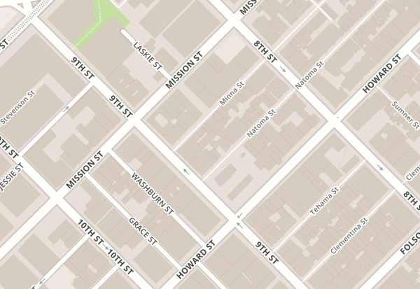
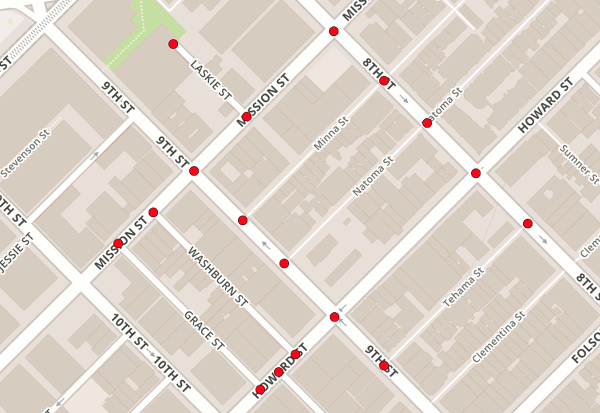
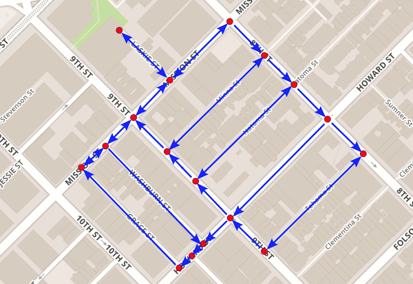
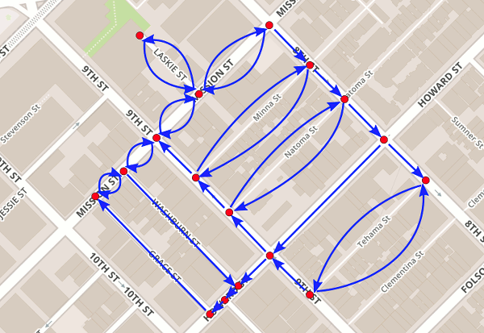
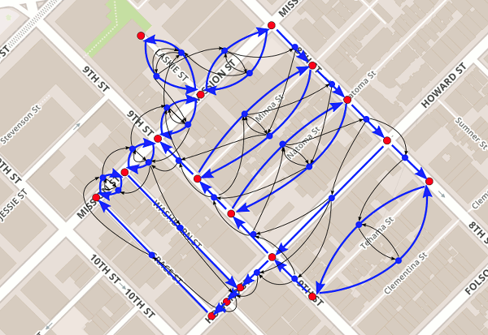
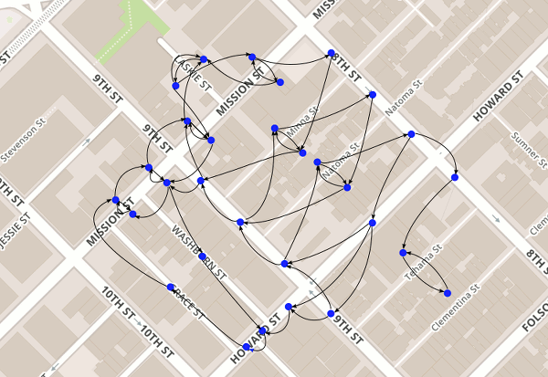
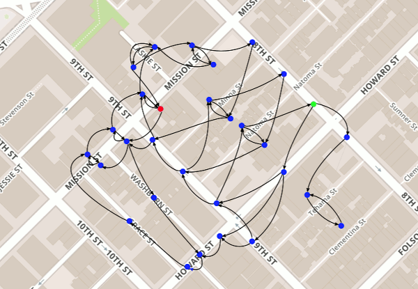
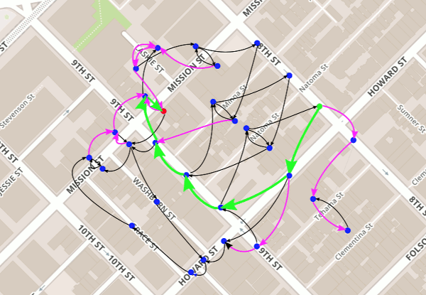
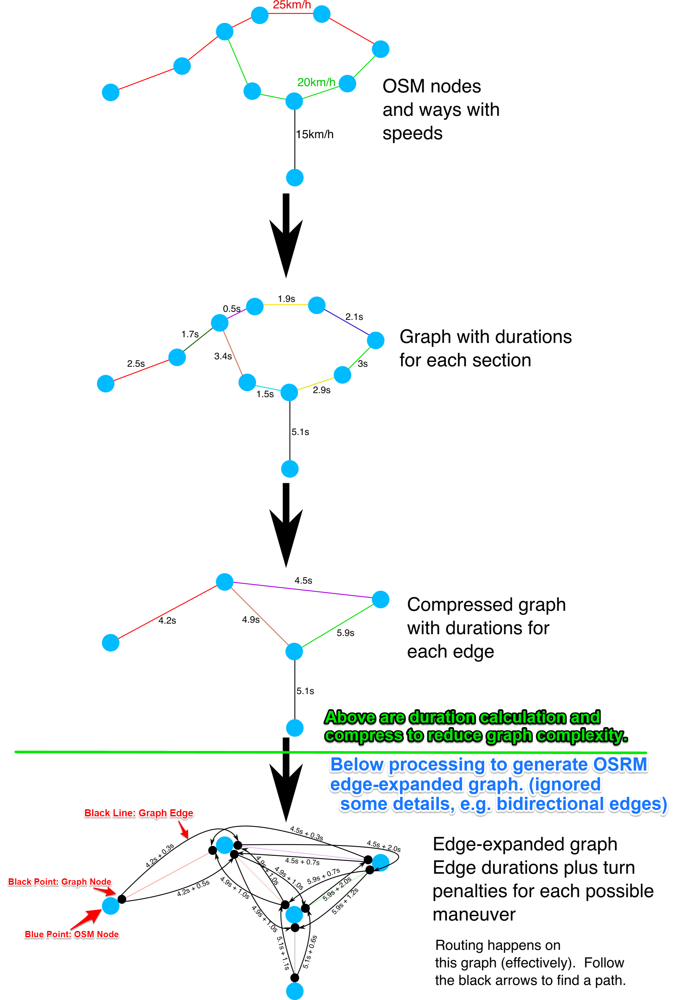

# Understanding OSRM Graph Representation
[OSRM](https://github.com/Project-OSRM/osrm-backend) will convert original map data (i.e. OSM) to an edge-expanded graph as first phase in [Processing Flow](https://github.com/Project-OSRM/osrm-backend/wiki/Processing-Flow), which exactly will be done by `osrm-extract`. All subsequent algorithms (i.e. Multi-Level Dijkstra, Contraction Hierarchies) will based on this edge-expanded graph.     
- Also read official documentation for better understanding: [Graph Representation](https://github.com/Project-OSRM/osrm-backend/wiki/Graph-representation).      
     

## Terminology
| Name |Belongs to|Synonym|Description|
|------|----------|-------|-----------|
|OSM Node|OSM||An OSM node is a 2D point with latitude and longitude, i.e. a geo-coordinate.|
|OSM Way|OSM||An OSM way connects a number of nodes. A way is thus a 2D poly-line, consisting of a number of segments. Several ways can share the same node where they cross.|
|OSM Relation|OSM||An OSM relation relates several nodes or ways, or both. It can be used for turn restrictions, routes, and other things. A relation is often not a physical structure, but an abstraction like a bus route for example.|
|Segment|OSRM|OSM Segment|A segment is a line connect 2 OSM nodes, undirected. A OSM way can be splitted to several segments.|
|Edge|OSRM|Node Based Edge|A Node Based Edge is a segment with direction. One segment can be splitted to 2 Node Based Edges with different direction. NOTE: This is not a imporant concept in OSRM. |
|Graph Node|OSRM|Edge Based Node|Similar with Node Based Edge, Graph Node represents a specific direction (forward or backward) of an segment. There are two graph nodes for a bidirectional segment, but only one if it's a oneway segment. In another word, use a graph node represent a edge. |
|Graph Edge|OSRM|Movement Based Edge, Edge Based Edge|A Graph Edge is a possible movement taking you from one Graph Node to another. I.e. FromGraphNode-ToGraphNode.|
|Edge-expanded Graph|OSRM||Edge-expanded Graph means a graph created by Graph Nodes and Graph Edges. OSRM loads the OSM data, and transforms it into an edge-expanded graph that's better suited for modelling turn costs and turn restrictions.|

## Process of Convert OSM to OSRM Edge-expanded Graph

## Process of Query Based on OSRM Edge-expanded Graph

## Basic Changes of Convert OSM to OSRM Edge-expanded Graph
Here's an image that shows the basic changes in the graph leading up to the edge-based graph. Some details (bidirectional edges) are ignored for the sake of simplicity:    

## Known Issues 
- via-way restrictions    
From issues [#2681](https://github.com/Project-OSRM/osrm-backend/issues/2681#issuecomment-313080353) and [#4439](https://github.com/Project-OSRM/osrm-backend/issues/4439), multiple vias of via-way restrictions have not been supported yet.      

## References
- [Graph Representation](https://github.com/Project-OSRM/osrm-backend/wiki/Graph-representation)
- [Processing Flow](https://github.com/Project-OSRM/osrm-backend/wiki/Processing-Flow)
- [OSRM's edge-expansion #4851](https://github.com/Project-OSRM/osrm-backend/issues/4851)
- [#2681](https://github.com/Project-OSRM/osrm-backend/issues/2681#issuecomment-313080353)
- [#4439](https://github.com/Project-OSRM/osrm-backend/issues/4439)